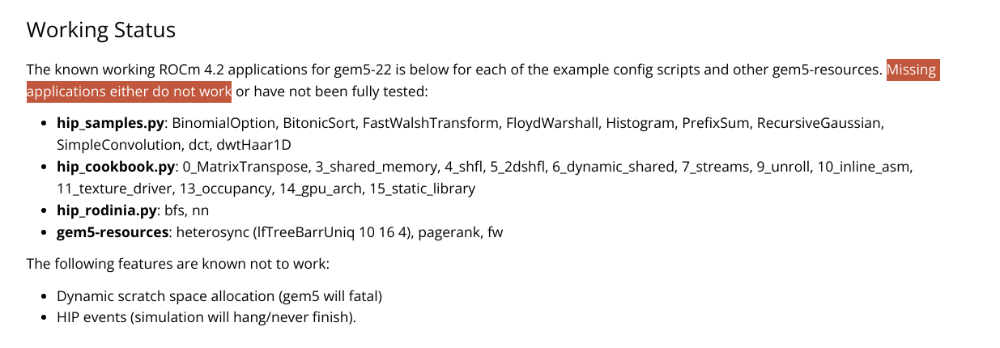

# Pointers for report

## 1. Why SE over FS?

- Limited (and recent) support in gem5 for FS mode. Also, slow! 
- What can we do? Mimic TLB miss/hit latencies in SE mode
- Where does it get us? Let us inspect three things total runtime, TLB hits and misses

## 2. Now that we have a baseline, let's analyze what modelling virtual memory in an execution-driven simulator might entail?

## 3. Can we make this better? Let's tweak the effect of TLB size, prefetcher